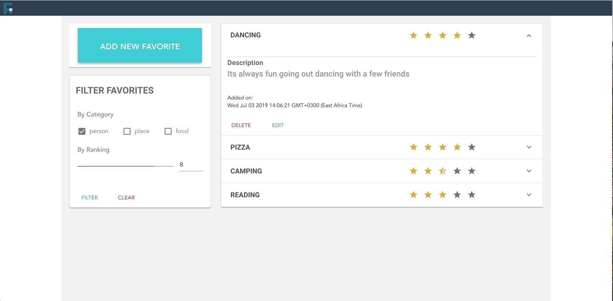

# favorite-things-front

[](https://travis-ci.org/matthewacha/favorite-things-front)
[](https://codeclimate.com/github/matthewacha/favorite-things-front/maintainability)

## About

Favorite-things is an application that enables you to keep track of all you favorite things. It is hosted at [https://favorite-things-front.herokuapp.com](https://favorite-things-front.herokuapp.com)

## Technologies
- Vue.js
- Vuex.js
- webpack
- vuetify
- mocha-webpack

The [backend service ](https://github.com/matthewacha/favorite-things) is an API built using the [Django Rest Framework](https://www.django-rest-framework.org/). Hosted on heroku [https://favorite-things-back.herokuapp.com/v1/](https://favorite-things-back.herokuapp.com/v1/)


## Project setup

### Clone repository
```
$ git clone https://github.com/matthewacha/favorite-things-front.git
```

### Install dependencies
```
yarn install
```

### Compiles and hot-reloads for development
```
yarn run serve
```

### Compiles and minifies for production
```
yarn run build
```

### Run your tests
```
yarn run test:unit
```

### Lints and fixes files
```
yarn run lint
```

### Run your end-to-end tests
```
yarn run test:e2e
```

### Run your unit tests
```
yarn run cover
```

## How to use the application


### Login

The application will require you to login with only your name. This is so that you only interface with your favorite things.


### Add favorite thing

When you feel excited about something new, this is how you add it to your favorite things


### Edit favorite thing

Here is how you change something about it


### Filter favorite things

When you need to find things that belong to a same category


### Delete Favorite thing

And some times, you just need to move on...




## Note

Images used in this project were sourced from [https://www.jlstms.com/](https://www.jlstms.com/fun-images.html)

## Author:

```
Matthew O Wacha
```